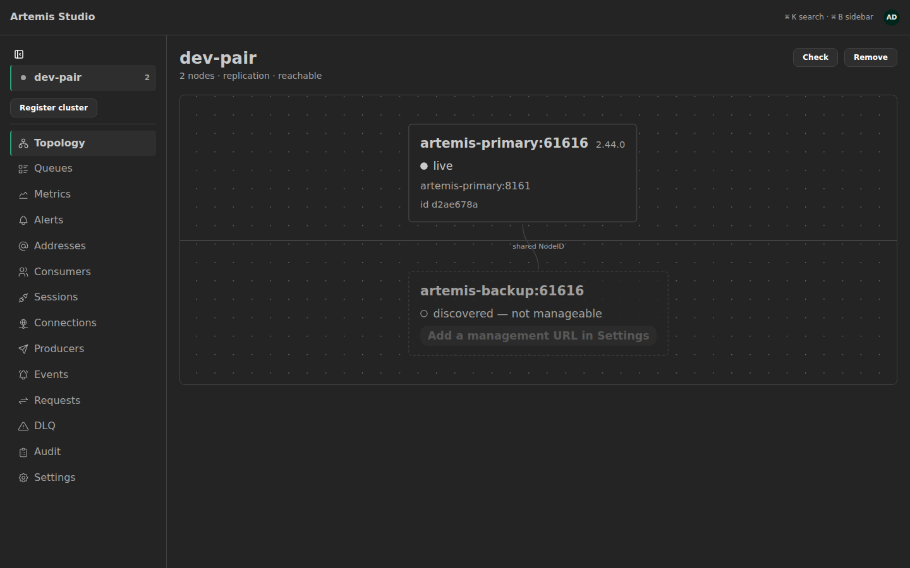
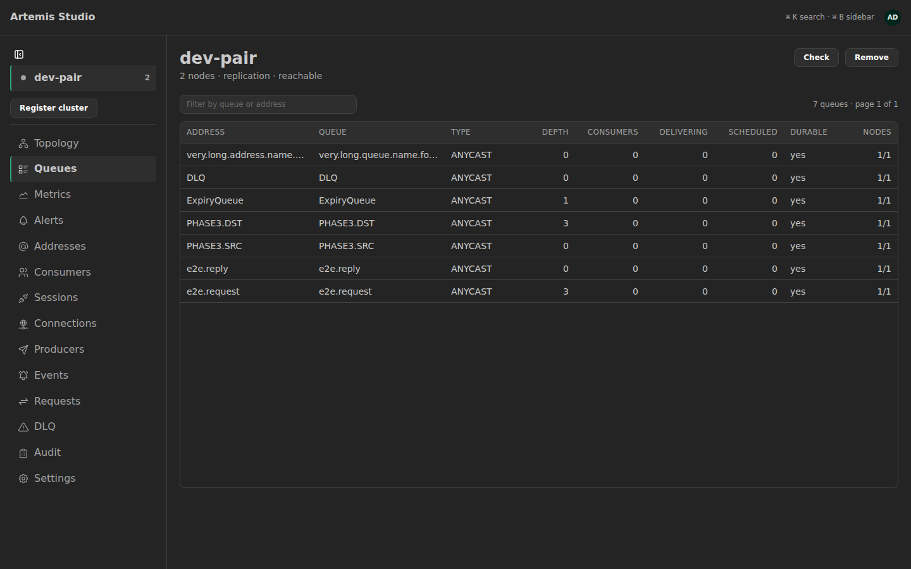
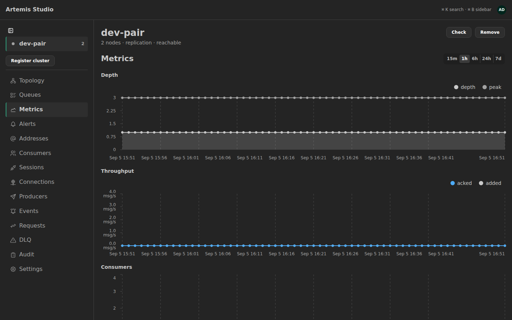
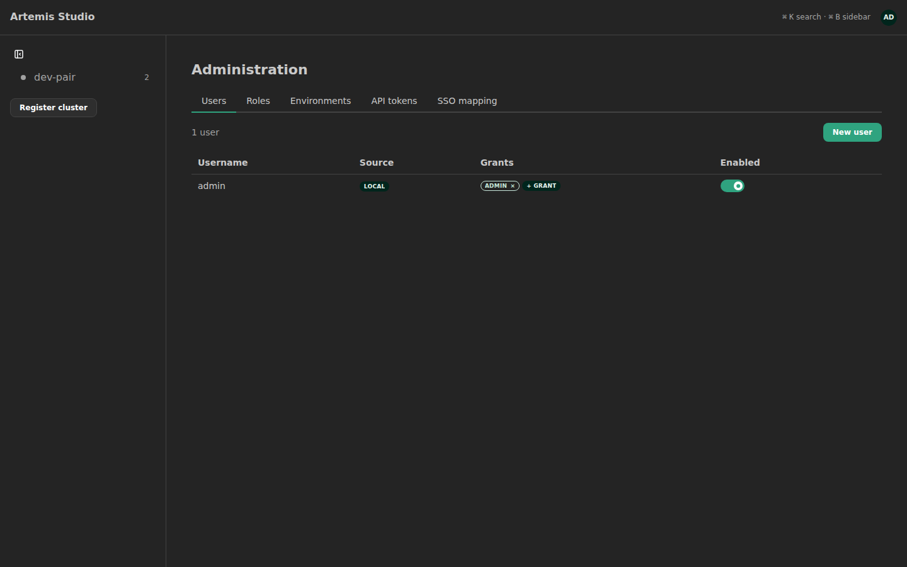

# Artemis Studio

> **⚠️ Work in progress — Artemis Studio is under active development and is not yet feature-complete. Expect breaking changes and incomplete functionality.**

> **🔐 Default login.** Username `admin`. There is no fixed default password —
> the first run against an empty database generates one and prints it **once**
> to the studio container's log (`docker compose -f deploy/compose/compose.dev.yaml
> logs studio | grep -A4 'Created administrator'`). You'll be forced to set a
> new password on first login. See [Quick start](#quick-start-dev) below.

**Cluster-wide management and observability for Apache ActiveMQ Artemis.**

The bundled Hawtio console manages one broker at a time and has no idea a cluster
exists. Artemis Studio is the other thing: one instance across many clusters —
live/backup topology, cross-node queues and addresses in a single table, safe
message operations, and first-class request-reply tracing.

It works against your **existing** brokers. No `broker.xml` rewrite beyond
enabling the management endpoints you almost certainly already run.

## Screenshots

| Cluster topology | Cross-node queues |
|---|---|
| [](docs/img/topology.png) | [](docs/img/queues.png) |
| **Metrics and charts** | **Governance (RBAC, environments, tokens, SSO)** |
| [](docs/img/metrics.png) | [](docs/img/governance.png) |

---

## Status

**Alpha.** Phases 0–8 are done: topology, cross-node queue/address/consumer views
over live SSE, message operations with dry-run and a server-enforced bulk cap,
a full audit trail, the Core client and request-reply tracing, metrics and
charts, alerting, and — as of Phase 8 — governance: every endpoint requires
authentication (session cookie for the browser, API tokens for automation,
optional OIDC/SSO), a dynamic role/permission model scoped to global /
environment / cluster, and per-environment cluster grouping. v1.0 (hardening
and reach) is next — see the [Roadmap](#roadmap).

## Quick start (dev)

```bash
just up          # Postgres + a real Artemis primary/backup pair + Artemis Studio
open http://localhost:8080
```

First run against an empty database creates an `admin` account and prints its
generated password **once**, in the studio container's log:

```bash
docker compose -f deploy/compose/compose.dev.yaml logs studio | grep -A4 'Created administrator'
```

Log in with it and you'll be forced to set a new password before doing
anything else (`must_change_password`, ADR-0037). Losing that first password
before changing it means resetting the account directly in Postgres — there
is no password-reset flow yet.

`just` on its own lists every task, grouped. Without `just`:

```bash
docker compose -f deploy/compose/compose.dev.yaml up --build -d
```

## Build and test

```bash
just verify          # backend (Liquibase vs Testcontainers Postgres, tests) + frontend build + lint
./mvnw -Pfrontend package   # single jar with the SPA baked in
```

Needs JDK 25, Node 22, Docker. A dev container is provided
(`.devcontainer/`, Ubuntu 26.04 LTS).

## Stack

| Layer | Choice | Why |
|---|---|---|
| Backend | Java 25, Spring Boot 4.1.0, Maven | — |
| Database | PostgreSQL, Liquibase migrations | [ADR-0008](docs/adr/0008-schema-migrations-liquibase.md) |
| Frontend | React 19 + Vite + Mantine 9, TanStack Router/Query/Table, React Flow | [ADR-0005](docs/adr/0005-frontend-stack-mantine-over-shadcn-and-mui.md) |
| Broker transport | Jolokia HTTP first, Artemis Core client second, capability-gated | [ADR-0002](docs/adr/0002-broker-transport-and-capability-model.md) |
| Realtime | SSE | [ADR-0003](docs/adr/0003-realtime-via-sse.md) |
| Packaging | one container image, Docker Compose first | [ADR-0007](docs/adr/0007-packaging-single-image-compose-first.md) |

Architecture: [`docs/architecture.md`](docs/architecture.md). All decisions:
[`docs/adr/`](docs/adr/).

## How work happens

Every feature goes through **OpenSpec** (`/opsx:propose` → `apply` → `archive`).
Significant decisions get an **ADR**. Library facts come from `ctx7`, not memory.
See [`CLAUDE.md`](CLAUDE.md) and [`.claude/rules/`](.claude/rules/).

---

## Roadmap

Phases 0–8 are **done** — everything in [Status](#status), from topology and
cross-node views through request-reply tracing, metrics, alerting, and
governance. What's left, roughly in order. Every feature phase goes through
OpenSpec (`/opsx:propose` → `apply` → `archive`); significant decisions get an
[ADR](docs/adr/).

### v1.0 · Hardening and reach

|  | Task |
|--|------|
| [ ] | Multi-instance HA — Postgres advisory lock per cluster |
| [ ] | Helm chart |
| [ ] | Docs site |
| [ ] | Slow-consumer detection |
| [ ] | Message replay from a captured payload |
| [ ] | Payload inspection helpers (pretty-print, type detection) |
| [ ] | Metric rollup tables — only when a query is measurably slow |

### Beyond

|  | Task |
|--|------|
| [ ] | ArkMQ operator integration (read broker CRs to auto-register) |
| [ ] | JMX transport |
| [ ] | Saved / shareable views |
| [ ] | Scheduled reports |
| [ ] | Broker config diff across a pair |
| [ ] | Prometheus scrape ingestion option |
| [ ] | Artemis MCP |


---

## Contributing

See [`CONTRIBUTING.md`](CONTRIBUTING.md). Issues and PRs welcome.

## Licence

[Apache-2.0](LICENSE). Same licence as Artemis itself.

Apache ActiveMQ and Apache ActiveMQ Artemis are trademarks of the Apache Software
Foundation. Artemis Studio is an independent project and is not produced by,
endorsed by, or affiliated with the Apache Software Foundation. References to
"Artemis" describe the broker this tool manages.
