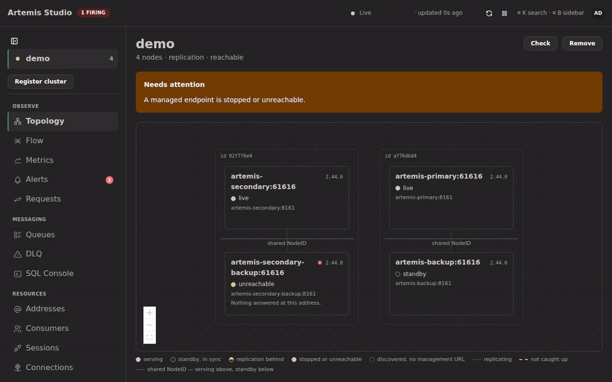
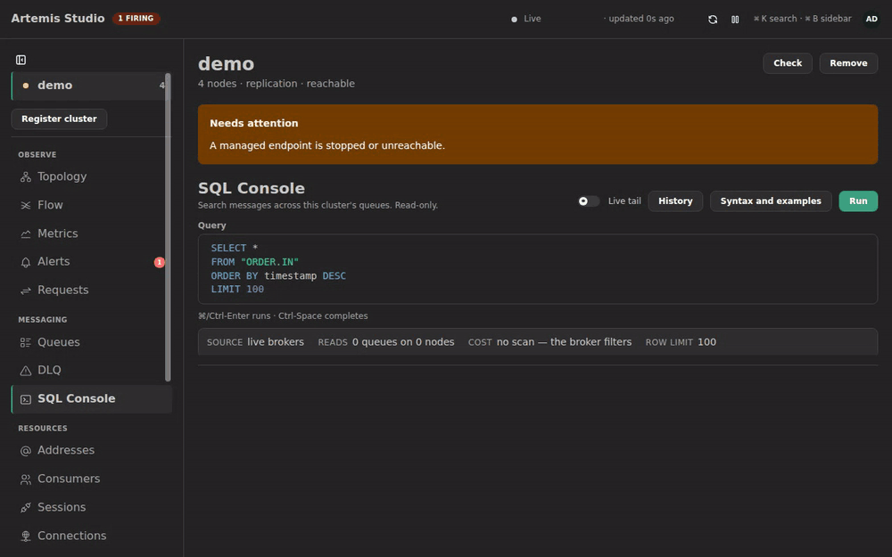

<div align="center">

# Artemis Studio

**一个控制台，管理你运行的每一个 Apache ActiveMQ Artemis 集群。**

实时拓扑、所有节点的所有队列汇入一张表、安全的消息操作，以及对消息的 SQL 查询——全部来自同一个实例。

[English](README.md) · **简体中文** · [فارسی](README.fa.md)

[](https://github.com/sudoitir/artemis-studio/actions/workflows/ci.yml)
[](https://github.com/sudoitir/artemis-studio/releases)
[](https://hub.docker.com/r/sudoit1/artemis-studio)
[](LICENSE)
[](https://github.com/sudoitir/artemis-studio/commits/main)
[](https://github.com/sudoitir/artemis-studio/stargazers)

[**文档**](https://sudoitir.github.io/artemis-studio/zh/) ·
[快速开始](https://sudoitir.github.io/artemis-studio/zh/guide/quickstart) ·
[SQL 控制台](https://sudoitir.github.io/artemis-studio/zh/guide/sql-console) ·
[MCP](https://sudoitir.github.io/artemis-studio/zh/guide/mcp) ·
[路线图](#路线图)

</div>

> [!WARNING]
> **Alpha 阶段。** 仍在积极开发中，功能尚未完备。已发布的镜像都是预发布的 dev 构建
> （`sudoit1/artemis-studio:dev`，暂无 `:latest`）。请预期会有破坏性变更。



## 为什么需要它

Artemis 自带的控制台**一次只管理一个 Broker**，并不知道集群的存在。在你的问题不跨节点之前，这没有问题——但真正重要的问题总是跨节点的：*哪个节点是 live*、*堆积在哪里*、*那条消息去了哪里*。

Artemis Studio 是另一回事：**一个实例，管理多个集群**，一切都以集群为单位。它针对你**现有的** Broker 运行——除了你几乎肯定已经开启的管理端点之外，不需要改动 `broker.xml`——而且它从不启动 Broker。

## 运行它

```bash
git clone https://github.com/sudoitir/artemis-studio && cd artemis-studio
just up          # Studio + Postgres，自动生成密钥，并固定到最新发布版本
```

然后打开 <http://localhost:8080>。`just up` 会把生成的 `admin` 密码打印一次；首次登录时会强制你修改它。

<details>
<summary>不使用 <code>just</code>，或对接你自己的 Postgres</summary>

```bash
base=https://raw.githubusercontent.com/sudoitir/artemis-studio/main/deploy/compose
curl -sO "$base/compose.prod.yaml"
curl -s "$base/.env.example" -o .env   # 然后编辑它
docker compose -f compose.prod.yaml --env-file .env up -d
```

```bash
docker run -p 8080:8080 \
  -e ARTEMIS_STUDIO_DB_URL=jdbc:postgresql://db:5432/artemis_studio \
  -e ARTEMIS_STUDIO_DB_USER=artemis_studio \
  -e ARTEMIS_STUDIO_DB_PASSWORD=... \
  -e ARTEMIS_STUDIO_SECRET_KEY="$(openssl rand -base64 32)" \
  sudoit1/artemis-studio:dev
```

每一个变量、SSE 流对反向代理的要求，以及首次登录的恢复方式，都在[配置指南](https://sudoitir.github.io/artemis-studio/zh/guide/configuration)中。

</details>

## 用 SQL 查询你的消息

Artemis 回答不了*"订单 4471 去哪了？"*。它唯一的服务端过滤器是 JMS selector：只看消息头——**永远看不到消息体**——而且一次只作用于一个节点上的一个队列。

```sql
SELECT * FROM "ORDER.*"
WHERE body->>'orderId' = '4471'
LIMIT 50
```



一个受限的只读方言——仅 `SELECT`，解析为 AST 并对照固定的列目录做校验，因此完全无法表达任何变更操作。消息头谓词会变成 JMS selector，不花代价；消息体谓词则是一次扫描。**计划条会在查询执行之前告诉你属于哪一类**，超过成本上限的查询会被拒绝并给出估算值，而不是被截断——截断后的结果一眼看去与完整结果无法区分。

再加上实时 tail（是轮询，绝非消费），以及可选启用、受保留期约束的索引，用于查询已被消费掉的消息。[了解更多 →](https://sudoitir.github.io/artemis-studio/zh/guide/sql-console)

## 它还能做什么

| 集群拓扑 | 跨节点队列 |
|---|---|
| [](docs/img/topology.png) | [](docs/img/queues.png) |
| **指标与图表** | **治理** |
| [](docs/img/metrics.png) | [](docs/img/governance.png) |

- **拓扑**——主备节点对与复制状态，HA 角色在每个周期从每个节点轮询得到。绝不读取配置文件；一对节点中出现两个 live 就是脑裂告警。
- **跨节点资源**——队列、地址、消费者、会话、连接与生产者汇入一张虚拟化表格，按节点标注来源，通过 SSE 更新。
- **消息操作**——浏览、发送、移动、重投、过期、删除、清空，每一个变更调用都支持 `?dryRun=true`，配合服务端强制的批量上限与按节点分别汇报的结果。
- **请求-应答追踪**——跨地址、跨节点关联请求与应答，并按声明的预期统计延迟与超时。
- **治理**——处处强制认证，按全局 → 环境 → 集群分层的角色/权限模型，API 令牌，可选 OIDC/SSO，以及与命令写在同一事务中的审计事件。
- **[MCP 服务器](https://sudoitir.github.io/artemis-studio/zh/guide/mcp)**——把同样的能力交给助手，遵循同样的授权与同样的审计链路。

## 建立在四条规则之上

**对 Broker 天然友好**——批量读取（每个节点一次 Jolokia POST，绝不是每个队列一次）、分层轮询、每节点限流器。Studio 绝不能成为 Broker 崩溃的原因。
**默认安全**——每一个破坏性调用都支持 dry run；清空与删除必须手动键入资源名称。
**绝不用配置判断 HA 状态**——谁是 live，要问活着的节点。
**诚实的能力门控**——不可用的功能会明说，并给出可以启用它的确切 `broker.xml`。没有任何东西会被悄悄隐藏。

## 参与开发

需要 JDK 25、Node 22、Docker 与 [`just`](https://github.com/casey/just#packages)。仓库提供了 dev container（`.devcontainer/`）。

```bash
just dev-up          # Postgres + 一对真实的 Artemis 主备节点 + 从源码构建的 Studio
just dev             # 或：后端 :8080 + Vite :5173，同时启动并热重载
just verify          # CI 运行的全部检查
```

`ADMIN_PASSWORD=… just demo` 会再加一对主备节点，并给全部四个节点灌入真实流量——一个没有消费者、堆积持续增长的地址，一份真实的死信积压，一个被停掉的节点。上面的截图与 GIF 都由 `just shots` 和 `just demo-gif` 从中录制，没有任何摆拍。

每个功能都要走 **OpenSpec**（`/opsx:propose` → `apply` → `archive`），重要决策都要写 [**ADR**](docs/adr/)。参见 [`CLAUDE.md`](CLAUDE.md) 与 [`CONTRIBUTING.md`](CONTRIBUTING.md)。

## 技术栈

Java 25 · Spring Boot 4.1 · PostgreSQL + Liquibase · React 19 + Vite + Mantine 9 · TanStack Router/Query/Table · React Flow · 主用 Jolokia HTTP、次用 Artemis Core 客户端 · SSE · 单一容器镜像。
[架构](https://sudoitir.github.io/artemis-studio/reference/architecture) ·
[全部 61 条决策](https://sudoitir.github.io/artemis-studio/reference/adr/)（英文）。

## 发布

每一次推送到 `main` 都会发布一个版本。采用 CalVer `YYYY.MM.PATCH`，Docker Hub 上有三个标签——`2026.09.3`（不可变）、`2026.09`（当月最新）、`dev`（全局最新）。在首个稳定版之前不会发布 `:latest`。每个版本还会附上可运行的 jar 及其 `.sha256`，发布说明由该版本的提交信息生成（[`changelog/`](changelog/)）。

## 路线图

阶段 0–8 已完成：拓扑、跨节点视图、消息操作、审计链路、Core 客户端与请求-应答追踪、指标、告警、治理、MCP 服务器，以及 SQL 控制台。剩下的部分：

|  | |
|--|--|
| [ ] | Divert 与 bridge 管理 |
| [ ] | 声明式期望状态与漂移检测 |
| [ ] | 多实例 HA——每个集群一把 Postgres advisory lock |
| [ ] | Helm chart |
| [ ] | 从捕获的载荷重放消息 |
| [ ] | ArkMQ operator 集成、JMX 传输、可保存视图、定时报表 |

## 许可证

[Apache-2.0](LICENSE)——与 Artemis 本身相同的许可证。

Apache ActiveMQ 与 Apache ActiveMQ Artemis 是 Apache 软件基金会的商标。Artemis Studio 是一个独立项目，并非由 Apache 软件基金会出品、背书或与之存在关联。文中对 "Artemis" 的引用，指的是本工具所管理的 Broker。

---

<div align="center">

如果它帮你省了时间，点一个 ⭐ 能让更多人发现它。

</div>
