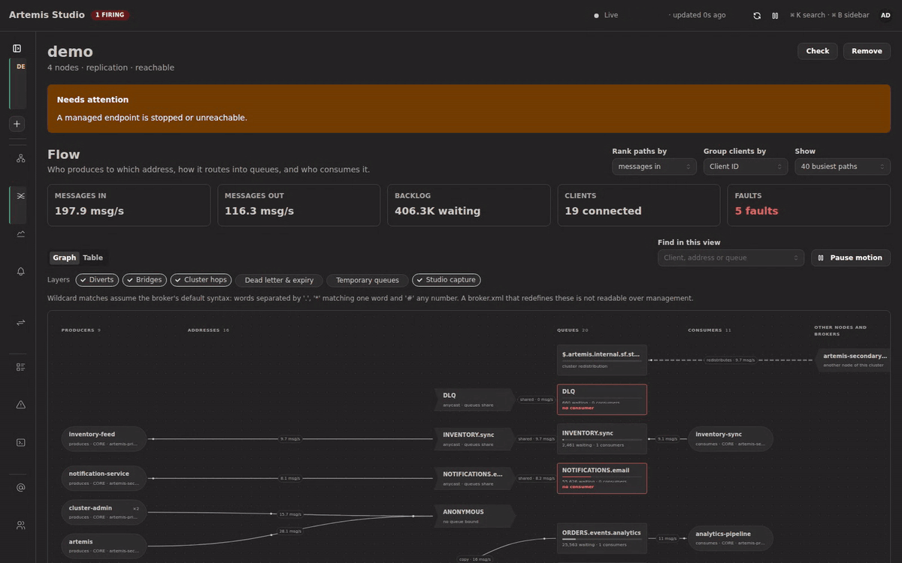

<div align="center">

# Artemis Studio

**一个控制台，管好你所有的 Apache ActiveMQ Artemis 集群。**

实时拓扑、所有节点的队列尽收一表、看得见的消息流向、安全的消息操作，还能用 SQL 查消息——一个实例全部搞定。

[English](README.md) · **简体中文** · [فارسی](README.fa.md)

[](https://github.com/sudoitir/artemis-studio/actions/workflows/ci.yml)
[](https://github.com/sudoitir/artemis-studio/releases)
[](https://hub.docker.com/r/sudoit1/artemis-studio)
[](LICENSE)
[](https://github.com/sudoitir/artemis-studio/commits/main)
[](https://github.com/sudoitir/artemis-studio/stargazers)

[**文档**](https://sudoitir.github.io/artemis-studio/zh/) ·
[快速开始](https://sudoitir.github.io/artemis-studio/zh/guide/quickstart) ·
[SQL 控制台](https://sudoitir.github.io/artemis-studio/zh/guide/sql-console) ·
[MCP](https://sudoitir.github.io/artemis-studio/zh/guide/mcp) ·
[路线图](README.md#roadmap)

</div>

> [!WARNING]
> **Alpha 阶段。** 项目仍在快速迭代，功能尚不完整。目前发布的镜像都是 dev 预览版
> （`sudoit1/artemis-studio:dev`，还没有 `:latest`），后续版本可能包含不兼容的变更。


## 功能一览

| 集群拓扑 | 跨节点队列 |
|---|---|
| [](docs/img/topology.png) | [](docs/img/queues.png) |
| **客户端与消息流向** | **SQL 控制台** |
| [](docs/img/flow.gif) | [](docs/img/sql-console.gif) |
| **指标与图表** | **治理** |
| [](docs/img/metrics.png) | [](docs/img/governance.png) |

- **拓扑**——展示主备节点对及其复制状态。HA 角色每个周期都从各节点实时轮询，从不依赖配置文件；同一对节点里出现两个 live，就会触发脑裂告警。
- **Flow（消息流向）**——一眼看清哪个应用往哪个地址发消息，消息如何经过 divert、bridge 和集群跳转进入队列，又被谁以什么速率消费。没有消费者、消息持续堆积之类的问题会直接用文字标出来；而且只有在有人查看时才会采样客户端，不给 Broker 额外负担。
- **[SQL 控制台](https://sudoitir.github.io/artemis-studio/zh/guide/sql-console)**——“订单 4471 到底去哪了？”Artemis 自己回答不了：它唯一的服务端过滤手段是 JMS selector，只能看消息头、看不到消息体，而且一次只能查一个节点上的一个队列。Studio 可以：

  ```sql
  SELECT * FROM "ORDER.*"
  WHERE body->>'orderId' = '4471'
  LIMIT 50
  ```

  查询语言是只读的 `SELECT`，并按固定的列清单校验，任何查询都改不了数据。针对消息头的条件会转换成 JMS selector，几乎零开销；针对消息体的条件需要扫描，**计划栏会在执行前告诉你属于哪一种**。超出代价上限的查询会直接拒绝并给出估算值，绝不会悄悄截断结果。你还可以开启实时追踪，或为某个队列开启[完整捕获](https://sudoitir.github.io/artemis-studio/zh/guide/message-capture)：Studio 维护一份在 Broker 上有容量上限的副本并持续消费它，这样即使消息在两次轮询之间就被消费掉，也依然查得到。
- **跨节点资源**——队列、地址、消费者、会话、连接和生产者汇总在同一张虚拟滚动表格里，每一行都标明所在节点，并通过 SSE 实时刷新。
- **消息操作**——浏览、发送、移动、重投、过期、删除、清空。所有变更类调用都支持 `?dryRun=true`，批量操作有服务端强制上限，结果按节点逐一汇报。
- **请求-应答追踪**——跨地址、跨节点把请求和应答对应起来，并对照你声明的预期统计延迟与超时。
- **[Broker 配置](https://sudoitir.github.io/artemis-studio/zh/guide/broker-configuration)**——声明一个集群应有的 address settings、security settings、divert 和队列。可以先在金丝雀节点上应用、写入前逐项说明风险，也可以导出为 `broker.xml` 片段，并随时查看各节点与声明之间的偏差。首次使用时，Studio 会把集群当前状态作为第 1 版提供给你，但不会替你擅自采纳。
- **数据治理**——自动遮蔽敏感的消息头和属性，自动识别个人敏感信息（PII），并按查看者的角色决定是否脱敏。
- **治理**——全面强制认证；角色与权限按“全局 → 环境 → 集群”分级授予；支持 API 令牌和可选的 OIDC/SSO；每一次变更及其结果都会记入审计。
- **[MCP 服务器](https://sudoitir.github.io/artemis-studio/zh/guide/mcp)**——把同样的能力开放给 AI 助手，适用同样的授权，留下同样的审计记录。

## 为什么做这个

Artemis 自带的控制台**一次只能管一个 Broker**，根本不知道集群的存在。只要问题不跨节点，这还说得过去；可真正要紧的问题偏偏都是跨节点的：*现在哪个节点是 live*、*消息堆在哪儿*、*那条消息去哪了*。

Artemis Studio 则**把集群当作一切的基本单位**，一个实例就能管理你的所有集群。它直接对接你**现有的** Broker——除了你多半早已开启的管理端点，`broker.xml` 不用做任何改动——而且它从不自己启动 Broker。

## 快速运行

```bash
git clone https://github.com/sudoitir/artemis-studio && cd artemis-studio
just up          # 启动 Studio + Postgres，自动生成密钥，并锁定到最新发布版本
```

然后打开 <http://localhost:8080>。`just up` 只会打印一次自动生成的 `admin` 密码，首次登录时必须修改。

<details>
<summary>不用 <code>just</code>，或者连接你自己的 Postgres</summary>

```bash
base=https://raw.githubusercontent.com/sudoitir/artemis-studio/main/deploy/compose
curl -sO "$base/compose.prod.yaml"
curl -s "$base/.env.example" -o .env   # 然后按需修改
docker compose -f compose.prod.yaml --env-file .env up -d
```

```bash
docker run -p 8080:8080 \
  -e ARTEMIS_STUDIO_DB_URL=jdbc:postgresql://db:5432/artemis_studio \
  -e ARTEMIS_STUDIO_DB_USER=artemis_studio \
  -e ARTEMIS_STUDIO_DB_PASSWORD=... \
  -e ARTEMIS_STUDIO_SECRET_KEY="$(openssl rand -base64 32)" \
  sudoit1/artemis-studio:dev
```

所有环境变量、反向代理为支持 SSE 需要做的设置，以及首次登录出问题时如何恢复，都写在[配置指南](https://sudoitir.github.io/artemis-studio/zh/guide/configuration)里。

</details>

## 四条基本原则

- **从设计上就对 Broker 友好。** 批量读取（每个节点一次 Jolokia POST，绝不按队列逐个请求）、分层轮询、按节点限流。Studio 绝不能成为压垮 Broker 的那根稻草。
- **默认安全。** 所有破坏性操作都可以先 dry run；清空和删除必须手动输入资源名称才能执行。
- **HA 状态只问节点，不看配置。** 谁是 live，只有正在运行的节点说了算。
- **能力限制坦诚相告。** 某项功能不可用时会明确说明，并给出启用它所需的确切 `broker.xml` 配置。绝不让功能悄无声息地消失。

## 参与开发

需要 JDK 25、Node 22、Docker 和 [`just`](https://github.com/casey/just#packages)。仓库自带 dev container（`.devcontainer/`）。

```bash
just dev-up          # Postgres + 一对真实的 Artemis 主备节点 + 从源码构建的 Studio
just dev             # 或者：同时启动后端 :8080 和 Vite :5173，支持热重载
just verify          # 运行 CI 的全部检查
```

`ADMIN_PASSWORD=… just demo` 会再加一对主备节点，并给四个节点灌入贴近生产的流量：经过 divert、bridge 和集群跳转的应用，一个没有消费者、堆积不断增长的地址，一批真实的死信消息，以及一个被停掉的节点。全新环境里打印出的密码只能用一次，所以第一次运行时请加上 `NEW_ADMIN_PASSWORD=…`，之后改用这个新密码。上面的截图和动图都是 `just shots` 和 `just demo-gif` 在这套环境里实录的，没有任何摆拍。

每个功能都要走 **OpenSpec** 流程（`/opsx:propose` → `apply` → `archive`），重要决策都记录为 [**ADR**](docs/adr/)。详见 [`CLAUDE.md`](CLAUDE.md) 和 [`CONTRIBUTING.md`](CONTRIBUTING.md)。

## 技术栈

Java 25 · Spring Boot 4.1 · PostgreSQL + Liquibase · React 19 + Vite + Mantine 9 · TanStack Router/Query/Table · React Flow · 以 Jolokia HTTP 为主、Artemis Core 客户端为辅 · SSE · 单一容器镜像。
[架构](https://sudoitir.github.io/artemis-studio/reference/architecture) ·
[全部 81 项架构决策](https://sudoitir.github.io/artemis-studio/reference/adr/)（英文）。

## 版本发布

每次推送到 `main` 都会自动发布一个版本。版本号采用 CalVer（`YYYY.MM.PATCH`），Docker Hub 上同时打三个标签：`2026.09.3`（固定不变）、`2026.09`（当月最新）和 `dev`（总是最新）。首个稳定版之前不提供 `:latest`。每个版本都附带可直接运行的 jar 及其 `.sha256`，发布说明由提交信息自动生成（见 [`changelog/`](changelog/)）。

## 路线图

完整的路线图见[英文 README](README.md#roadmap)。

## 许可证

[Apache-2.0](LICENSE)，与 Artemis 本身使用相同的许可证。

Apache ActiveMQ 和 Apache ActiveMQ Artemis 是 Apache 软件基金会的商标。Artemis Studio 是独立项目，并非由 Apache 软件基金会出品或认可，也与其没有任何隶属关系。文中提到的 “Artemis” 均指本工具所管理的 Broker。

---

<div align="center">

如果它帮你省下了时间，欢迎点个 ⭐，让更多人发现它。

</div>
