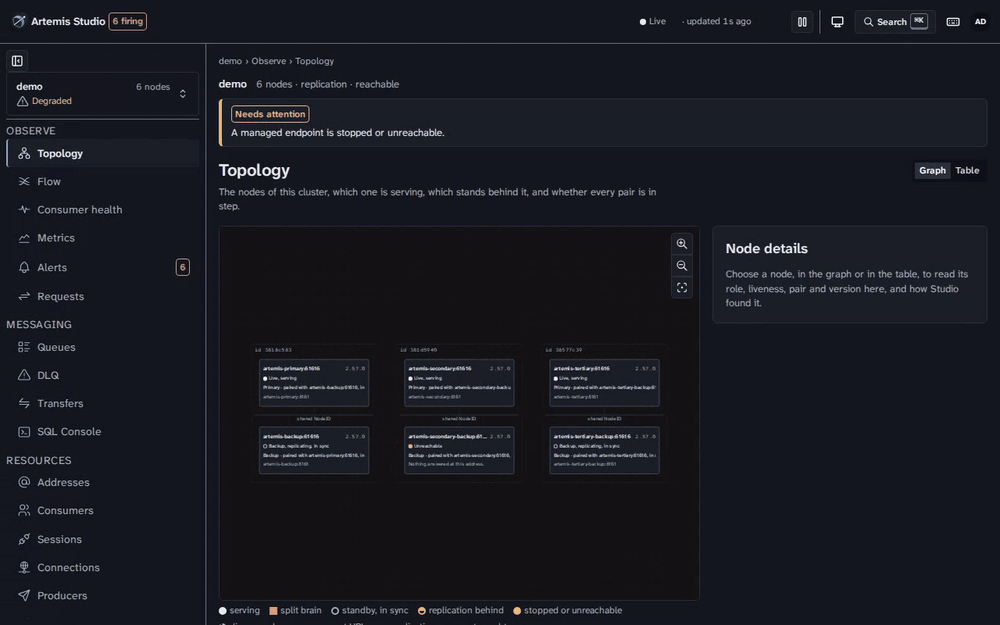
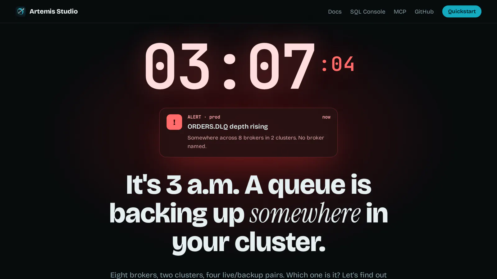
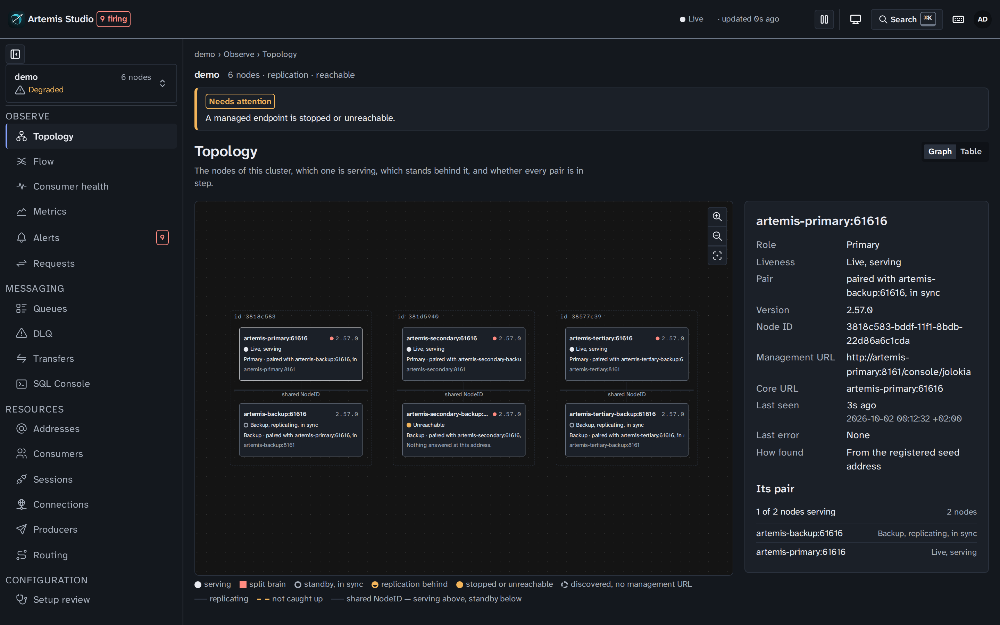
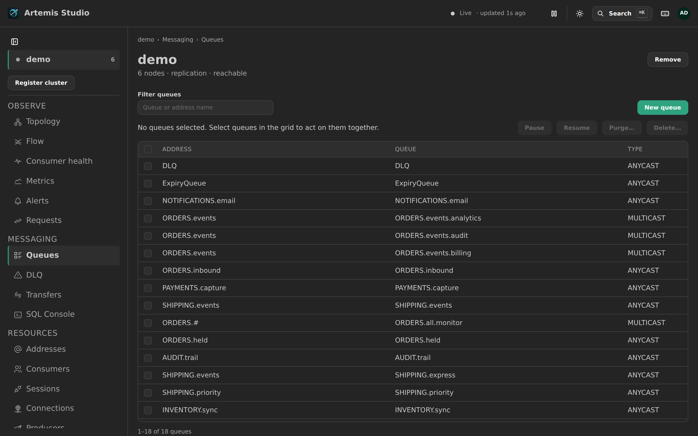
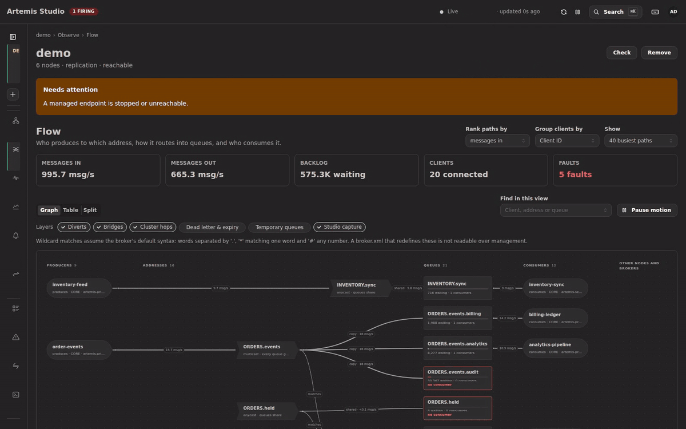
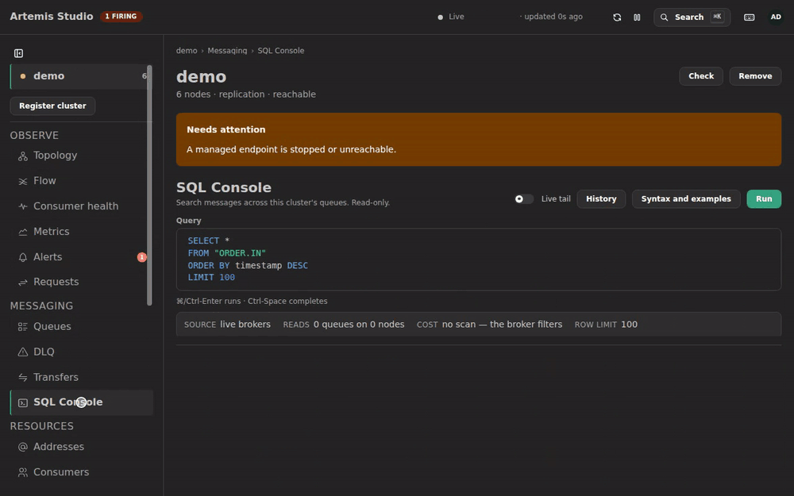
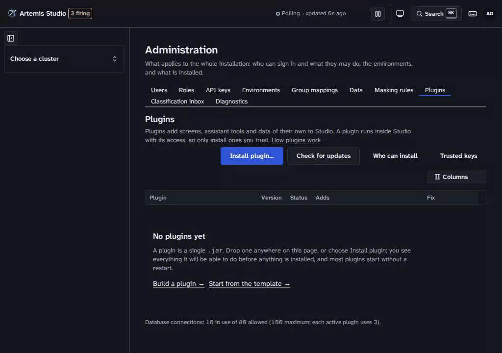
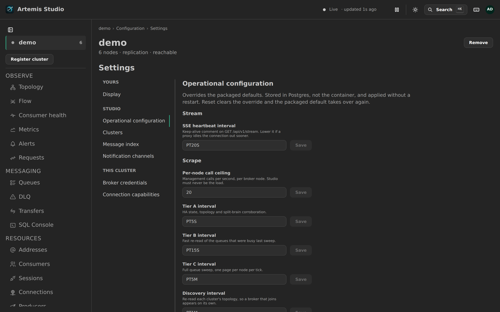

<div align="center">


# Artemis Studio

**一个控制台，管好你所有的 Apache ActiveMQ Artemis 集群。**

实时拓扑、所有节点的队列尽收一表、看得见的消息流向、安全的消息操作，还能用 SQL 查消息——一个实例全部搞定。

<a href="https://sudoitir.github.io/artemis-studio/zh/"></a><br>
<sub>一场凌晨 3 点的交互式故障排查 · 约 2 分钟 · 直接在浏览器里运行</sub>

[English](README.md) · **简体中文** · [فارسی](README.fa.md)

[](https://github.com/sudoitir/artemis-studio/actions/workflows/ci.yml)
[](https://github.com/sudoitir/artemis-studio/releases)
[](https://hub.docker.com/r/sudoit1/artemis-studio)
[](https://scorecard.dev/viewer/?uri=github.com/sudoitir/artemis-studio)
[](https://sonarcloud.io/summary/new_code?id=sudoitir_artemis-studio)
[](https://sonarcloud.io/summary/new_code?id=sudoitir_artemis-studio)
[](https://sonarcloud.io/summary/new_code?id=sudoitir_artemis-studio)
[](https://sonarcloud.io/summary/new_code?id=sudoitir_artemis-studio)
[](https://sonarcloud.io/summary/new_code?id=sudoitir_artemis-studio)
[](LICENSE)

[文档](https://sudoitir.github.io/artemis-studio/zh/guide/) ·
[快速开始](#快速开始) ·
[Flow](https://sudoitir.github.io/artemis-studio/guide/flow) ·
[SQL Console](https://sudoitir.github.io/artemis-studio/zh/guide/sql-console) ·
[MCP](https://sudoitir.github.io/artemis-studio/zh/guide/mcp) ·
[讨论区](https://github.com/sudoitir/artemis-studio/discussions)

</div>

> [!WARNING]
> **Alpha 阶段。** 项目仍在快速迭代，功能尚不完整。目前发布的镜像都是稳定版之前的 dev 构建
> （`sudoit1/artemis-studio:dev`，还没有 `:latest`），后续版本可能包含不兼容的变更。



## 快速开始

用已发布的镜像启动 Studio 及其 Postgres。你的 Broker 保持原样：在界面里注册即可，这里不会启动任何 Broker。

```bash
base=https://raw.githubusercontent.com/sudoitir/artemis-studio/main/deploy/compose
curl -sO "$base/compose.prod.yaml"
curl -s "$base/.env.example" | sed \
  -e "s|^SECRET_KEY=.*|SECRET_KEY=$(openssl rand -base64 32)|" \
  -e "s|^DB_PASSWORD=.*|DB_PASSWORD=$(openssl rand -hex 24)|" > .env
docker compose -f compose.prod.yaml --env-file .env up -d
docker compose -f compose.prod.yaml logs studio | grep -A4 'Created administrator'
```

打开 <http://localhost:8080>，用 `admin` 和最后一行打印出的密码登录。这个密码只显示一次，首次登录时你会设置自己的密码。

<details>
<summary>克隆仓库后用 <code>just</code> 启动，或者单独跑一个容器、连接你自己的 Postgres</summary>

```bash
git clone https://github.com/sudoitir/artemis-studio && cd artemis-studio
just up          # 同一套环境，锁定到最新发布版本
```

```bash
docker run -p 8080:8080 \
  -e ARTEMIS_STUDIO_DB_URL=jdbc:postgresql://db:5432/artemis_studio \
  -e ARTEMIS_STUDIO_DB_USER=artemis_studio \
  -e ARTEMIS_STUDIO_DB_PASSWORD=... \
  -e ARTEMIS_STUDIO_SECRET_KEY="$(openssl rand -base64 32)" \
  sudoit1/artemis-studio:dev
```

</details>

所有环境变量、反向代理为支持 SSE 流需要做的设置，以及首次登录信息丢失后如何恢复，都写在[配置指南](https://sudoitir.github.io/artemis-studio/zh/guide/configuration)里。

## 为什么做这个

凌晨 3 点，集群里某个地方的 `ORDERS.DLQ` 正在堆积。Artemis 自带的控制台一次只能管一个 Broker，根本不知道集群的存在。于是你只能每个节点开一个标签页，在每个页面里逐层展开 JMX 树，一个个属性看过去，直到找到它为止。

Artemis Studio 则**把集群当作一切的基本单位**。所有集群的所有节点都画在同一张拓扑图上，HA 角色实时轮询；所有节点上的所有队列都汇总在一张表里、按深度排序，你要找的那个队列就在第一行。一个实例就能管理你运行的所有集群，直接对接你现有的 Broker。

<a href="https://sudoitir.github.io/artemis-studio/zh/"></a>

**[▶ 体验这个故事](https://sudoitir.github.io/artemis-studio/zh/)**：先亲手找一遍这个队列，每个 Broker 一个标签页；再看 Studio 如何在一个屏幕上把它找出来。

## 功能一览

| 集群拓扑 | 跨节点队列 |
|---|---|
| [](docs/img/topology.png) | [](docs/img/queues.png) |
| **客户端与消息流向** | **SQL Console** |
| [](docs/img/flow.gif) | [](docs/img/sql-console.gif) |
| **插件** | **设置** |
| [](docs/img/plugin-install.gif) | [](docs/img/settings.png) |

- **拓扑**——展示主备节点对及其复制状态。HA 角色每个周期都从各节点实时轮询，从不依赖配置文件；同一对节点里出现两个 live，就会触发脑裂告警。
- **[Flow](https://sudoitir.github.io/artemis-studio/guide/flow)（消息流向）**——一眼看清哪个应用往哪个地址发消息，消息如何经过 divert、bridge 和集群跳转进入队列，又被谁以什么速率消费。没有消费者、消息持续堆积之类的问题会直接用文字标出来；而且只有在有人查看时才会采样客户端。
- **[SQL Console](https://sudoitir.github.io/artemis-studio/zh/guide/sql-console)（SQL 控制台）**——“订单 4471 到底去哪了？”Artemis 自己回答不了：它唯一的服务端过滤手段是 JMS selector，只能看消息头、看不到消息体，而且一次只能查一个节点上的一个队列。Studio 可以：

  ```sql
  SELECT * FROM "ORDER.*"
  WHERE body->>'orderId' = '4471'
  LIMIT 50
  ```

  查询语言是只读的 `SELECT`，并按固定的列清单校验，任何查询都改不了数据。针对消息头的条件会转换成 JMS selector，零开销；针对消息体的条件需要扫描，**计划栏会在执行前告诉你属于哪一种**。超出代价上限的查询会直接拒绝并给出估算值，绝不会悄悄截断结果。你还可以开启实时追踪，或为某个队列开启[完整捕获](https://sudoitir.github.io/artemis-studio/zh/guide/message-capture)：Studio 持续消费一份在 Broker 上有容量上限的副本，这样即使消息在两次轮询之间就被消费掉，也依然查得到。
- **跨节点资源**——队列、地址、消费者、会话、连接和生产者汇总在同一张虚拟滚动表格里，每一行都标明所在节点，并通过 SSE 实时刷新。
- **消息操作**——浏览、发送、移动、重投、过期、删除、清空。所有变更类调用都支持 `?dryRun=true`，批量操作有服务端强制上限，结果按节点逐一汇报。
- **请求-应答追踪**——跨地址、跨节点把请求和应答对应起来，并对照你声明的预期统计延迟与超时。
- **[Broker 配置](https://sudoitir.github.io/artemis-studio/zh/guide/broker-configuration)**——声明一个集群应有的 address settings、security settings、divert、bridge 和队列，并在画布上编排它们之间的路由。可以先在金丝雀节点上应用、写入前逐项说明风险，也可以导出为 `broker.xml` 片段，并随时查看各节点偏离了哪些配置。首次使用时，Studio 会把集群当前状态作为第 1 版提供给你，但不经你同意绝不采纳；bridge 则永远不会被自动采纳，因为 Broker 只会报告它的一部分信息。
- **[配置审查](https://sudoitir.github.io/artemis-studio/guide/setup-review)**——对照已知的常见错误，逐个检查每个集群的 HA、集群化、持久化和消息安全配置：只有一对复制节点、无法赢得仲裁投票；redistribution 停留在 `-1`；connector 对外宣告的是 `localhost`；没有死信地址。每条发现都附带各节点的证据和对应的 `broker.xml` 修复方法，也可以作为已知风险接受，并注明理由、留档备查。
- **[告警投递](https://sudoitir.github.io/artemis-studio/guide/alert-delivery)**——支持 Slack、Microsoft Teams、PagerDuty（事件随告警自动开启和解决）、邮件和带签名的 webhook。每个渠道保存前都会先测试，投递日志会告诉你通知为什么发送失败。
- **[数据治理](https://sudoitir.github.io/artemis-studio/guide/data-governance)**——自动遮蔽敏感的消息头和属性，自动识别个人敏感信息（PII），并按查看者的角色决定是否脱敏。
- **治理**——全面强制认证；角色与权限按“全局 → 环境 → 集群”分级授予；支持 API 令牌和可选的 OIDC/SSO；审计记录每一次变更及其结果。
- **[MCP 服务器](https://sudoitir.github.io/artemis-studio/zh/guide/mcp)**——把同样的能力开放给 AI 助手，适用同样的授权，留下同样的审计记录。
- **[插件](https://sudoitir.github.io/artemis-studio/guide/plugins)**——在界面里直接安装插件的 `.jar`：它可以带来自己的页面、API、助手工具和数据。确认之前，它能做的一切都会展示给你；除非确有需要，否则无需重启。更新时会列出变化并支持回滚；插件出错也绝不会拖垮 Studio。可以从[插件模板](examples/plugin-template)开始写一个。

## 工作原理

四条原则贯穿整个产品：

- **从设计上就对 Broker 友好。** 批量读取（每个节点一次 Jolokia POST，绝不按队列逐个请求）、分层轮询、按节点限流。Studio 绝不能成为压垮 Broker 的那根稻草。
- **默认安全。** 所有破坏性操作都可以先 dry run；清空和删除必须手动输入资源名称才能执行。
- **HA 状态只问节点，不看配置。** 谁是 live，只有 live 节点自己知道。
- **能力限制坦诚相告。** 某项功能不可用时会明确说明，并给出启用它所需的确切 `broker.xml` 配置。绝不让功能悄无声息地消失。

Java 25 · Spring Boot 4.1 · PostgreSQL + Liquibase · React 19 + Vite + Mantine 9 · TanStack Router/Query/Table · React Flow · 以 Jolokia HTTP 为主、Artemis Core 客户端为辅 · SSE · 单一容器镜像。详见[架构说明](https://sudoitir.github.io/artemis-studio/reference/architecture)和[全部架构决策记录](https://sudoitir.github.io/artemis-studio/reference/adr/)。

## 参与贡献

问题和想法请发到[讨论区](https://github.com/sudoitir/artemis-studio/discussions)，bug 请提 [issue](https://github.com/sudoitir/artemis-studio/issues/new/choose)，安全漏洞请走[私密报告](https://github.com/sudoitir/artemis-studio/security/advisories/new)（见 [SECURITY.md](SECURITY.md)）。自行构建需要 JDK 25、Node 24、Docker 和 [`just`](https://github.com/casey/just#packages)；仓库自带 dev container。

```bash
just dev-up          # Postgres + 一对真实的 Artemis 主备节点 + 从源码构建的 Studio
just dev             # 或者：同时启动后端 :8080 和 Vite :5173，支持热重载
just verify          # 运行 CI 的全部检查
```

`ADMIN_PASSWORD=… just demo` 会再加两对主备节点，并给全部六个节点灌入贴近生产的流量：divert、一个 bridge、集群跳转、一个没有消费者且不断增长的积压、一批真实的死信积压，以及一个被停掉的节点。上面的截图和动图都是 `just shots` 和 `just demo-gif` 在这套环境里实录的，没有任何摆拍。

每个功能都要走 **OpenSpec** 流程，重要决策都记录为 [**ADR**](docs/adr/)。从 [`CONTRIBUTING.md`](CONTRIBUTING.md) 开始。

## 版本发布

每次改动应用本身的合并都会自动发布一个版本。版本号采用 CalVer（`YYYY.MM.PATCH`），Docker Hub 上同时打三个标签：`2026.09.3`（固定不变）、`2026.09`（当月）和 `dev`（最新）。首个稳定版之前不提供 `:latest`。每个版本都附带可直接运行的 jar 及其 `.sha256`，发布说明由提交信息自动生成（见 [GitHub Releases](https://github.com/sudoitir/artemis-studio/releases)）。插件 API（Maven Central）和 SDK（npm）随改动它们的版本一同发布。

## 许可证

[Apache-2.0](LICENSE)，与 Artemis 本身使用相同的许可证。

Apache ActiveMQ 和 Apache ActiveMQ Artemis 是 Apache 软件基金会的商标。Artemis Studio 是独立项目，并非由 Apache 软件基金会出品或认可，也与其没有任何隶属关系。文中提到的 “Artemis” 均指本工具所管理的 Broker。

---

<div align="center">

如果它帮你省下了时间，欢迎点个 ⭐，让更多人发现它。

</div>
